# TOPDOGS

This site is targeted at dog lovers to view photos and brief profiles of other dogs from around the world. The site also offers the opportunity for users to get involved and to submit their own dog to be published on the site for other users to admire. 

## User experience design

### Strategy
* Defining the goals - after speaking with friends and family about thier current needs and things that may be missing from their lives, i soon established a commom theme. During these difficult times through out lockdowns and a global pandemic it was noticable to the majority of people i spoke to that there was a sever lack of positive news. 
* what is the idea? From this research i narrowed down my idea to having a site that was based on joy and positivity. I followed up with the same focus group and found that dogs came out as the common theme when asked to say what brings them joy and positivity.
* who is the target audience? From this i came up with a target audience of dog lovers or people that need a smile or simply a break from the current negative tone within the main stream media. 
* why should it be created? Offering something that could potentially make someone smile or to improve wellbeing or at the very ;ease, a distraction to the negativity in the news has the potentical to benefit user.

### Scope
* features and functions - gallery of images of dogs looking happy, ready to spread the joy.
* content requirements - simple but effective. 

### Structure
* how will content be organised and presented - site map
    * 3 page design - homepage, gallery and contact page

### Skeleton
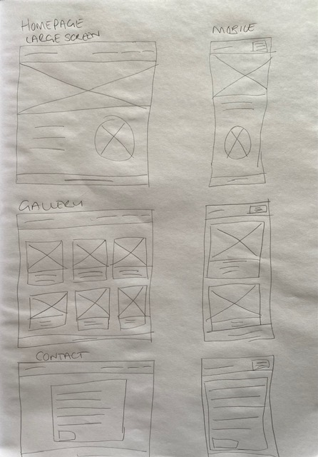

### Surface
* Following the C.R.A.P (consistancy, repetition, alignment and proximity) design methodology the pages will all have the same nav bar, footer and color scheme. This will help create a positive user experience. 

## Features

### Home page

* Navigation bar

    * Featured on all three pages, the full responsive bar includes Logo (links to homepage), home page, gallery and contact page and is identical in each page to allow for easy navigation.
    * This section will allow the user to easily navigate between pages without having to revert back to the previous page via the browsers back button.
    * The navigation bar uses a collapsed 'hamburger' style for the link on mobile devices and smaller screen sizes. 

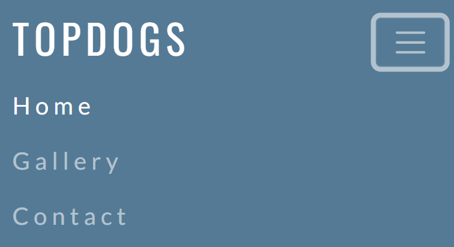

* Header top (home page main image)

    * The home page main image is a photograph made up of dogs so that users can immediatly visualise the context of the site.
    * The image has an overlay with text that describes the exact purpose of the site
    * the image is repeated horizontally so that on larger screens it gives the illusion of more dogs. 

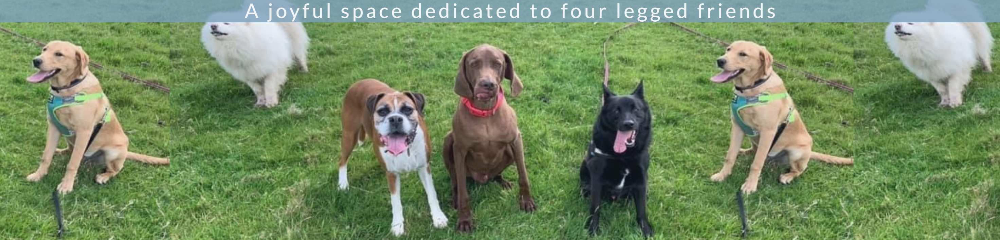
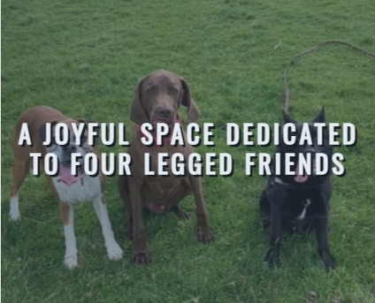

* Header bottom

    * The header bottom provides details on how a user can get involved with the site with a button directing them to the contact page.
    * Another image of a dog provides further context of what the site is about.
    * The header bottom is responsive to screen size and will adjust accordingly.

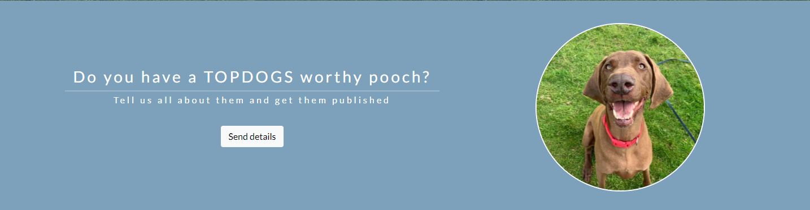
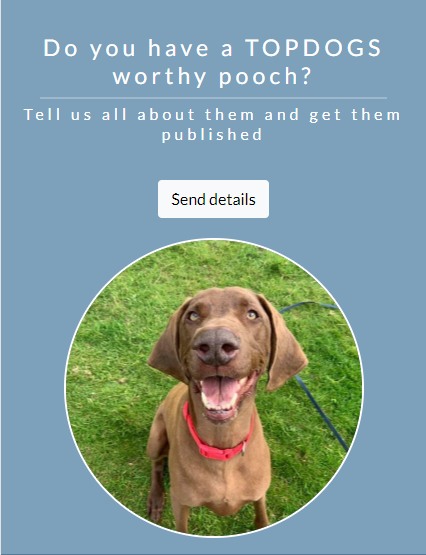

* Footer

    * The footer section is repeated across all 3 pages for consistancy so the user can become comfortable with the layout no matter which page they are on.
    * The footer contains links to social media accounts that open in new windows so that they can easily go back to the page they were on.

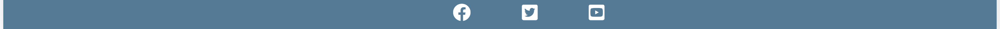

### Gallery page

* The gallery section is where users can see dogs submitted form other users. Each dog shows a photo with a brief profile consisting of name, age and location. They utilise the responsive card layout of bootstrap with a 4 column view on larger screens down to a single column on a mobile view. 

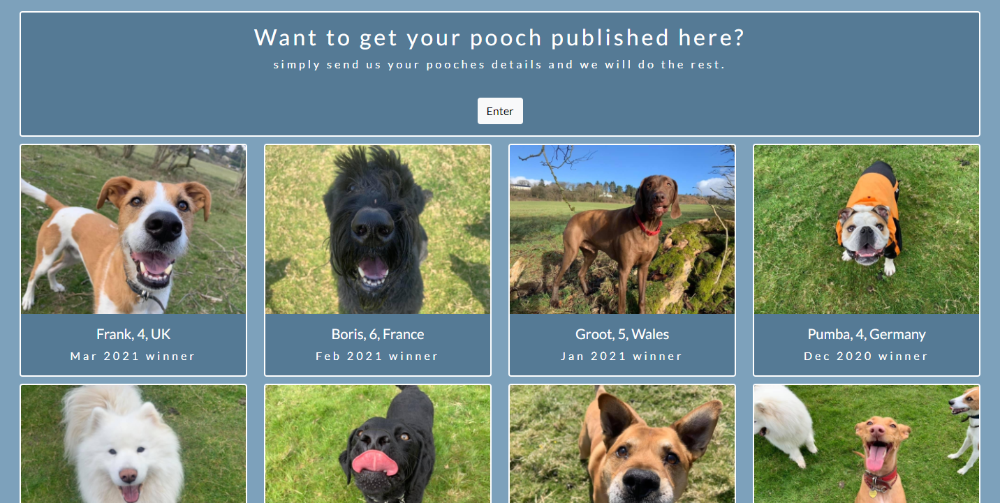
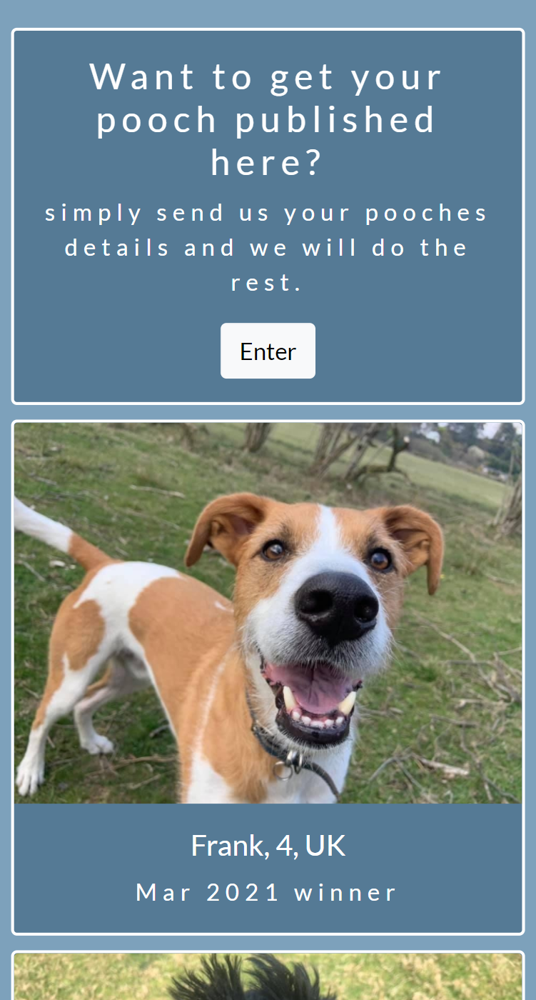

### Contact page

* The contact page gives a responsive form which has media query in the custom style sheet to control the max width on larger screens. The form utilises the bootstrap form control styles and button. it uses required fields so ensure all relevant data is collected. The form is not functional in that it does not post the data on submit, it is for static purposes only in the project. 

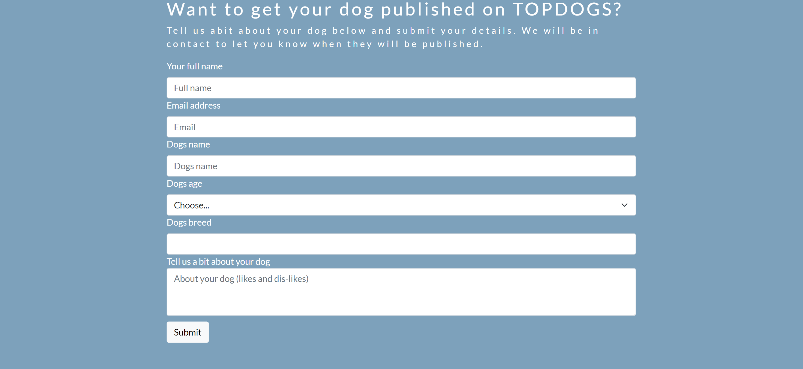
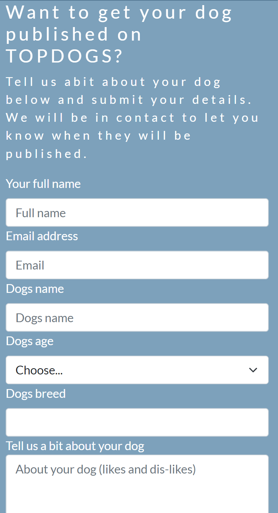

## Testing

* [material.io]('https://material.io/resources/color/#!/?view.left=1&view.right=1&primary.color=557a95&secondary.color=33691E']) was used to check accessibility of text colours on background colours. Also used to find complemetary colours. This is where i decided on my 2 shades of blue with white text. As the result was that black was not legible on these shades of blue. Credit to my mentor Akshat for showing me this resource. 

* [Chrome developer tools](https://developer.chrome.com/docs/devtools/) on the browser was used to see any errors on the pages.

* [Chrome developer tools](https://developer.chrome.com/docs/devtools/) device toggle toolbar was utilised to view the site via emulators of different screen sizes. This is when i noticed that the form on the contact page looked good on the mobile view but was taking up too much width on a large screen size so i put in a media query for larger screen sizes only to reduce the width of the contact form.

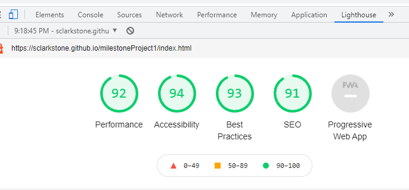

* Chrome Lighthouse audit (Chrome -> dev tolls -> Lighthouse) was run to for performance, accessibility, SEO and best practices.

### User Acceptance Testing

The UAT was carried out on desktop, tablet and mobile screen sizes. The UAT was also caaried out on Chrome, firefox and Edge. This was to ensure cross broswer and cross device compatability and to acieve a positive user experience. 

#### Home page

Test | Expected Outcome | Actual outcome|status
-----|------------------|----------------|--------
Images|All images appear, sized correctly with alt tags|Hero image, circle image and font awesome social media images all loaded correctly| Pass
fonts|fonts use specified google fonts| Oswald and Lanto fonts load|Pass
Nav bar|responsive navbar with varying screen sizes| Nav bar is full width with visable logo text and page links on desktop and tablet screen. On mobile screen sizes it is full width with a collapsed 'hamburger' toggle hiding the page links until pressed.|Pass 
links|internal link to remain in current window and external links to open in new tab| Social media images in footer all open associated sites in a new tab. 'Send details' button opens internal link in same window to contact page.|Pass
Header bottom|responsive layout| text and circular image side by side on desktop and tablet screen sizes. Circular image below text on mobile screen sizes.|Pass 

#### Gallery

Test | Expected Outcome | Actual outcome|status
-----|------------------|----------------|--------
Images|All images appear, sized correctly with alt tags|All card images of individual dogs appear, the correct size with the correct alt tages|Pass
Nav bar|responsive navbar with varying screen sizes| Nav bar is full width with visable logo text and page links on desktop and tablet screen. On mobile screen sizes it is full width with a collapsed 'hamburger' toggle hiding the page links until pressed.|Pass 
links|internal link to remain in current window and external links to open in new tab| Social media images in footer all open associated sites in a new tab. 'Enter' button opens internal link in same window to contact page.|Pass
Cards|responsive columns|columns of 4 cards on desktop and tablet screens and 1 column on mobile screens |Pass

#### Contact

Test | Expected Outcome | Actual outcome|status
-----|------------------|----------------|--------
Nav bar|responsive navbar with varying screen sizes| Nav bar is full width with visable logo text and page links on desktop and tablet screen. On mobile screen sizes it is full width with a collapsed 'hamburger' toggle hiding the page links until pressed.|Pass 
links|internal link to remain in current window and external links to open in new tab| Social media images in footer all open associated sites in a new tab. 'Send details' button open internal link in same window.|Pass
Form|responsive width|Full width on mobile screen and 60% width on larger desktop screens |Pass

### Validator testing

* HTML using [W3C validator](https://validator.w3.org/nu/?doc=https%3A%2F%2Fsclarkstone.github.io%2FmilestoneProject1%2F) - index.html

    * 'Warning: Attribute title is not serializable as XML 1.0.' - on reviewing the code there was a missing closing tag for the custom style sheet on the line before the title tag. I corrected this by adding the closing tag '/>', re run through validator and error was resolved. I applied this to each page.

    * 'Error: End tag nav seen, but there were open elements.' - on looking at the code i had a div that was opened inside of the nav but closed outside it. so i moved the closing div inside of the nav. re run through validator and the error was resolved.  I applied this to each page.

    * 'Error: Stray start tag script'. after looking at my code i noticed that the script tag was outside of the body tag. I moved the script tag to be inside the body closing tag but remaining at the bottom of the page. re run the validator and the error was resolved.  I applied this to each page.

    * After correcting the above errors and re running the w3c validator the following message came 'Document checking completed. No errors or warnings to show'.

* HTML using W3C validator - gallery.html

    * 'Error: Stray end tag head.' on looking at the code i could see a duplicate closing head tag. i removed the duplicate. re run the validator and the error was resolved. 

    * 'Error: Duplicate ID card.' after looking at the code i noticed that the style used for each photo in the gallery was using the same id for each instead of having the same name as the class. ameneded the id to be class name and amended the style class to reflect this too. re run validator and this resolved the error. 

    * After correcting the above errors and re running the w3c validator the following message came 'Document checking completed. No errors or warnings to show'.

* HTML using W3C validator - contact.html 

    * 'Error: Duplicate ID contact.' - after looking at the code i could see that i was using the same id name for both the section and container div. i removed the unused id on the container div. re run the validator and this resolved the error.

    * 'Error: Bad value for attribute action on element form: Must be non-empty.' - after looking at the code i saw that the action in the form tag was empty.  i removed the action form the form. re run the validator and this resolved the error.

    * After correcting the above errors and re running the w3c validator the following message came 'Document checking completed. No errors or warnings to show'.

* CSS

    * No errors were found when passing through the offical [(Jigsaw) validator](https://jigsaw.w3.org/css-validator/validator?uri=https%3A%2F%2Fsclarkstone.github.io%2FmilestoneProject1%2Fassets%2Fcss%2Fstyles.css&profile=css3svg&usermedium=all&warning=1&vextwarning=&lang=en) for my custom style.css. however, 17 errors were found in the bootstrap cdn. 

### Mentor review
After the second review with my mentor some recommendations for improvements were made. I carried out these recommendations, they are listed below;

* Homepage
    * TOPDOGS logo to mirror the padding-left as what the last nav bar item has padding-right so it is semetrical.
    * Remove the span tags on both background images that were failing to give the images an alt tag. Alt tags are not needed on background images.
    * Remove unused css styles max and min height on #header-bottom.
    * Add margin-top on the Button to give some space between it and the text.
    * The title tage should be directly below the meta tags and it should be reflective of each page rather then the generic title on each. 
    * Match the height of the footer with the header by adding padding to give a more semetrical apperance. 
    * Add align-items: center to the header bottom left about text to align it vertically centrally with the image in right about.
    * Increase the size of the image in right-about so that it fills the space better.
    * Remove the #welcome background colour as the text does not stand out enough. Instead use display-flex, align-items: center and background color: rgb(0, 0, 0, 0.4). Along with increasing the font weight, changing the h3 to a h1 and adding a text shadow.

* Gallery
    * Add some padding to the gallery-section to give some space on the page, the objective here is to make sure the page does not look over crowded. This padding would need a media query as the mobile screen would need less padding then a desktop/tablet screen size.
    * The title tage should be directly below the meta tags and it should be reflective of each page rather then the generic title on each. 
    * Match the height of the footer with the header by adding padding to give a more semetrical apperance. 

* Contact
    * Add some padding to the contact-section to give some space on the page, the objective here is to make sure the page does not look over crowded. This padding would need a media query as the mobile screen would need less padding then a desktop/tablet screen size.
    * align the header centrally for a more semetrical apperance
    * The title tage should be directly below the meta tags and it should be reflective of each page rather then the generic title on each. 
    * Match the height of the footer with the header by adding padding to give a more semetrical apperance. 

### Bugs

* font awesome was not loading images and was giving an error of 'Failed to load resource: the server responded with a status of 404'. On further investigation i found that i was using the CSS link (link href="/your-path-to-fontawesome/css/fontawesome.css" rel="stylesheet") with a non existant pathway, rather then the hosted CDN link. I was able to correct this issue by taking out the incorrect CSS link and replaing it with the CDN link.

* After publishing the site to github pages none of the images loaded and chrome developer tools gave an error of 'Failed to load resource: the server responded with a status of 404 ()'

* After publishing the site to github pages chrome developer tools showed an error of 'Error with Permissions-Policy header: Unrecognized feature: 'interest-cohort'.'

* After publishing the site to github pages on the developer tools an error was present. 'Failed to load resource: /favicon.ico:1 the server responded with a status of 404 ()'. After reading about the error on [GitHub comminity](https://github.community/t/favicon-with-github-pages/10242) i found the issue to be that a favicon needed to placed in the header and that the linked image needed to be of a size 32px x 32px. I then resized and saved one of my images and saved in the images folder called favicon and added the link to the head file of each page. I re run the validator and the error was resolved. 

## Desirable features
This site for the purpose of this milestone project is a Minimum Viable Product (MVP) and contains essential features that allow it to function. Possible deseriable features for future development include;

* Notifications - users can sign up to receive noticifications of content updates. This would utilise the users preferred contact method. 
* user profiles - a log in area for users to maintain profiles including preferred contact mehtod and notification frequency.
* Voting - users would be able to vote for an annual winner from the monthly TOPDOGs on the site. 

These development ideas would require the static site to utilise a backend database to store and call upon user information. 

## Deployment

The site was deployed to GitHub pages. The steps to deploy are as follows:

* In the GitHub repository, navigate to the Settings tab
* Select Pages on left side menu
* Select the Master Branch
* Click save
* The page will be automatically refreshed with a detailed ribbon display to indicate the successful deployment.

The live link can be found here - [site link](https://sclarkstone.github.io/milestoneProject1/)

## Credits

### Layout
* github - code institute/gitpod-full-template

* [bootstrap V5](https://getbootstrap.com/docs/5.0/getting-started/introduction/)

    * nabar
    * grid layout with rows and columns
    * form controls
    * gallery cards
    
* [Code institute](https://learn.codeinstitute.net/) course material. Specially the 'Love Running' tutorial gave me the inspiration and guidance for the layout of this site.

### Content

* The icons in the footer were taken from [Font awesome](https://fontawesome.com/)

* [google fonts](https://fonts.google.com/) was used to give the project a more professional and unique feel. Google fonts gave fonts that go together and as i had already seen the Lanto font in use on the Code institute 'love running' project and felt it fit in well with my project i went with Lant and Oswald. 

* [material.io]('https://material.io/resources/color/#!/?view.left=1&view.right=1&primary.color=557a95&secondary.color=33691E']) was used to check accessibility of text colours on background colours. Also used to find complemetary colours. This is where i decided on my 2 shades of blue with white text. As the result was that black was not legible on these shades of blue. Credit to my mentor Akshat for showing me this resource. 

### Media

* The photos of the dogs used throughout the site are of my own dog (Groot) and dogs known to me from who all go to [Andys woodland walks](https://www.facebook.com/andyswoodlandwalks/) where my dog attends. Permission from the Owners and Andrew was granted before use. 
